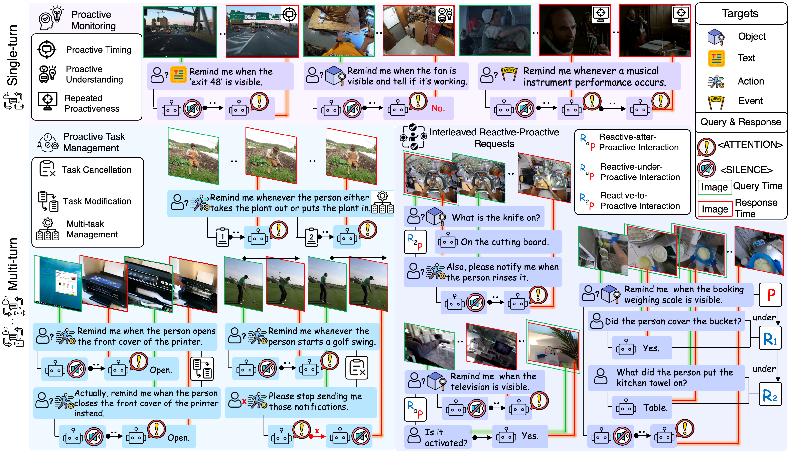
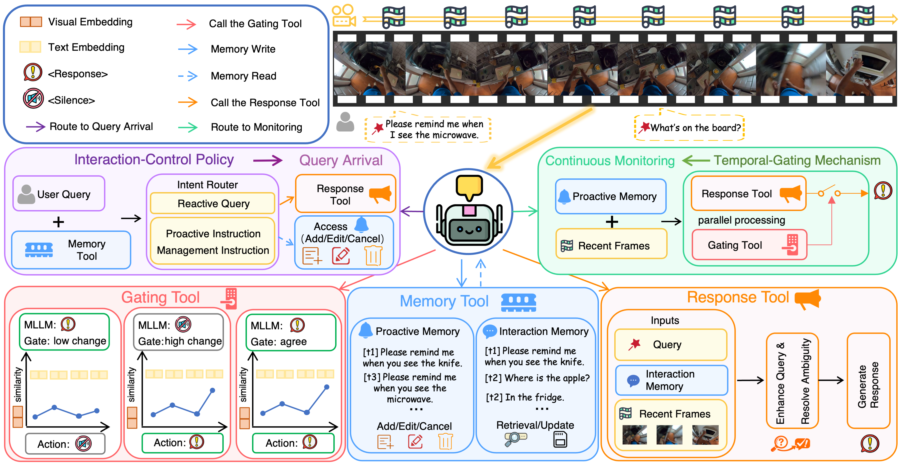

# IPIBench: Evaluating Interactive Proactive Intelligence of MLLMs under Continuous Streams

<p align="center">
  <a href="https://lijinzhao30.github.io/IPIBench/"></a>
  <a href="https://lijinzhao30.github.io/IPIBench/paper.pdf"></a>
  <a href="Benchmark/"></a>
</p>

## Overview

Recent multimodal large language models (MLLMs) have made strong progress on reactive visual question answering. Real streaming assistants, however, need to move beyond passively answering questions: they must continuously observe visual streams, proactively respond at the right moment, support multi-turn interaction, and adapt when users add, modify, or cancel requests.

**IPIBench** evaluates this capability as **Interactive Proactive Intelligence** under continuous video streams. It covers three major interaction settings:

- **Proactive Monitoring**: when to trigger, what to understand, and how to maintain sustained and stable responses.
- **Proactive Task Management**: how to manage user instructions across cancellation, modification, and multiple concurrent tasks.
- **Interleaved Reactive–Proactive Requests**: how to coordinate reactive questions with ongoing proactive goals in multi-turn streaming scenarios.



## Contributions

- We introduce **IPIBench**, the first benchmark for evaluating interactive proactive intelligence of MLLMs under streaming video settings.
- We conduct systematic evaluations and failure analyses on proprietary, open-source, and online streaming models, revealing unstable proactive triggering and weak multi-turn interaction coordination.
- We propose **IPI-Agent**, a training-free agentic framework with an interaction-control policy and temporal-gating mechanism, improving proactive triggering stability and multi-turn coordination for existing offline MLLMs.

## Data preparation

First clone this repository:

```bash
git clone https://github.com/lijinzhao30/IPI.git
cd IPI
```

The benchmark annotations are already included in [`Benchmark/`](Benchmark/). The full benchmark package, including frame archives, is hosted on [Hugging Face](https://huggingface.co/datasets/lijinzhao30/IPIBench):

```text
lijinzhao30/IPIBench
├── Benchmark/
│   ├── Interleaved_Reactive_Proactive/
│   ├── Proactive_Monitoring/
│   └── Proactive_Task_Management/
└── Frames/
    ├── Interleaved_Reactive_Proactive.tar
    ├── Proactive_Monitoring.tar
    └── Proactive_Task_Management.tar
```

Download the three frame archives from `Frames/` on Hugging Face and extract them into the repository-level [`Image/`](Image/) directory. After preparation, the expected layout is:

```text
IPI/
├── Benchmark/
│   ├── Interleaved_Reactive_Proactive/*.json
│   ├── Proactive_Monitoring/*.json
│   └── Proactive_Task_Management/*.json
├── Image/
│   ├── Interleaved_Reactive_Proactive/<task>/<sample_id>/<frame>.png
│   ├── Proactive_Monitoring/<task>/<sample_id>/<frame>.png
│   └── Proactive_Task_Management/<task>/<sample_id>/<frame>.png
├── Src/Qwen3_VL_8B/
├── Evaluate/
└── Result/Qwen3_VL_8B/
```

## Evaluation

We provide a reference evaluation pipeline using **Qwen3-VL-8B**. The process has two stages: first run inference to produce a result JSON file, then run the corresponding evaluator to compute the final score.

### Step 1: run inference

Example for `Proactive_Monitoring/Proactive_Timing`:

```bash
python Src/Qwen3_VL_8B/Proactive_Monitoring/Proactive_Timing.py \
  --input_json Benchmark/Proactive_Monitoring/Proactive_Timing.json \
  --frame_base_dir Image/Proactive_Monitoring/Proactive_Timing \
  --output_json Result/Qwen3_VL_8B/Proactive_Monitoring/Proactive_Timing.json \
  --model_path /path/to/local/qwen3-vl-model \
  --batch_size 16 \
  --max_tokens 500 \
  --max_frames 16
```

The inference script writes a JSON file under `Result/Qwen3_VL_8B/<task_group>/<task_name>.json`. This output path is the input consumed by the scoring script in the next step.

### Step 2: compute the score

Use the evaluator with the result JSON from Step 1 and the matching benchmark JSON:

```bash
python Evaluate/Proactive_Monitoring/Proactive_Timing.py \
  --result Result/Qwen3_VL_8B/Proactive_Monitoring/Proactive_Timing.json \
  --benchmark Benchmark/Proactive_Monitoring/Proactive_Timing.json
```

The same two-step interface applies to the released tasks:

| Task group | Task name | Inference script | Evaluation script |
| --- | --- | --- | --- |
| `Proactive_Monitoring` | `Proactive_Timing` | `Src/Qwen3_VL_8B/Proactive_Monitoring/Proactive_Timing.py` | `Evaluate/Proactive_Monitoring/Proactive_Timing.py` |
| `Proactive_Monitoring` | `Proactive_Understanding` | `Src/Qwen3_VL_8B/Proactive_Monitoring/Proactive_Understanding.py` | `Evaluate/Proactive_Monitoring/Proactive_Understanding.py` |
| `Proactive_Monitoring` | `Repeated_Proactiveness` | `Src/Qwen3_VL_8B/Proactive_Monitoring/Repeated_Proactiveness.py` | `Evaluate/Proactive_Monitoring/Repeated_Proactiveness.py` |
| `Proactive_Task_Management` | `Multi_task_Management` | `Src/Qwen3_VL_8B/Proactive_Task_Management/Multi_task_Management.py` | `Evaluate/Proactive_Task_Management/Multi_task_Management.py` |
| `Proactive_Task_Management` | `Task_Cancellation` | `Src/Qwen3_VL_8B/Proactive_Task_Management/Task_Cancellation.py` | `Evaluate/Proactive_Task_Management/Task_Cancellation.py` |
| `Proactive_Task_Management` | `Task_Modification` | `Src/Qwen3_VL_8B/Proactive_Task_Management/Task_Modification.py` | `Evaluate/Proactive_Task_Management/Task_Modification.py` |
| `Interleaved_Reactive_Proactive` | `Reactive_after_Proactive` | `Src/Qwen3_VL_8B/Interleaved_Reactive_Proactive/Reactive_after_Proactive.py` | `Evaluate/Interleaved_Reactive_Proactive/Reactive_after_Proactive.py` |
| `Interleaved_Reactive_Proactive` | `Reactive_to_Proactive` | `Src/Qwen3_VL_8B/Interleaved_Reactive_Proactive/Reactive_to_Proactive.py` | `Evaluate/Interleaved_Reactive_Proactive/Reactive_to_Proactive.py` |
| `Interleaved_Reactive_Proactive` | `Reactive_under_Proactive` | `Src/Qwen3_VL_8B/Interleaved_Reactive_Proactive/Reactive_under_Proactive.py` | `Evaluate/Interleaved_Reactive_Proactive/Reactive_under_Proactive.py` |

## IPI-Agent

IPI-Agent turns existing offline MLLMs into more stable, stateful streaming assistants without additional training. It separates interaction control, temporal gating, memory, and response generation so that the agent can decide when to respond, when to stay silent, and how to preserve context across evolving user requests.



## Repository status

- ✅ **IPIBench data**: benchmark annotations are released in this repository and the frame archives are available on Hugging Face.
- ✅ **Reference evaluation code**: a Qwen3-VL-8B based example inference and evaluation pipeline is released under [`Src/Qwen3_VL_8B/`](Src/Qwen3_VL_8B/) and [`Evaluate/`](Evaluate/).
- 🚧 **IPI-Agent code**: coming soon.

## Citation

If you find this work useful, please cite:

```bibtex
@article{li2026ipibench,
  title={IPIBench: Evaluating Interactive Proactive Intelligence of MLLMs under Continuous Streams},
  author={Li, Jinzhao and Chen, Yinuo and Song, Wenxuan and Lei, Yijia and Zhang, Yichi and Yan, Honglei and Pan, Panwang and Liu, Miao},
  journal={arXiv preprint arXiv:2605.27074},
  year={2026}
}
```
